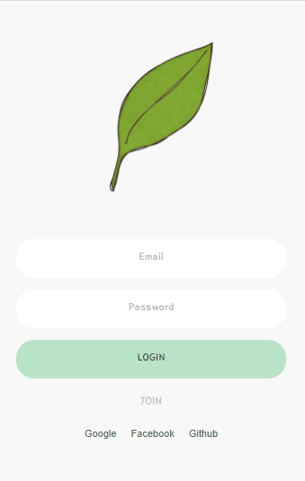
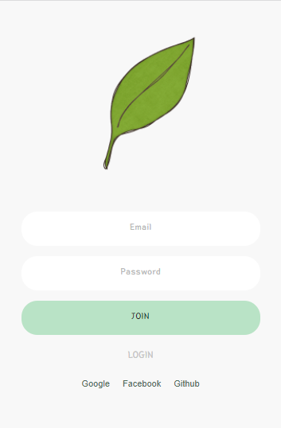
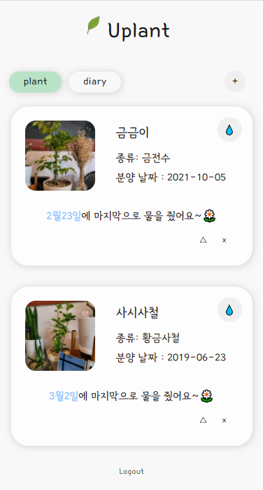
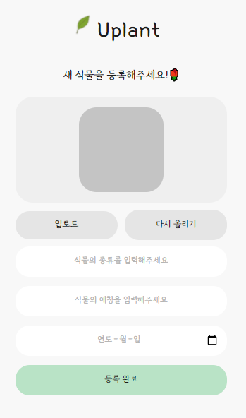
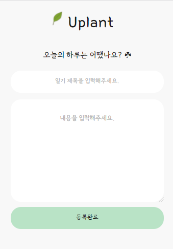
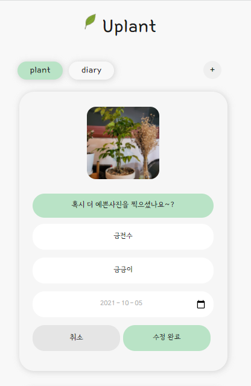
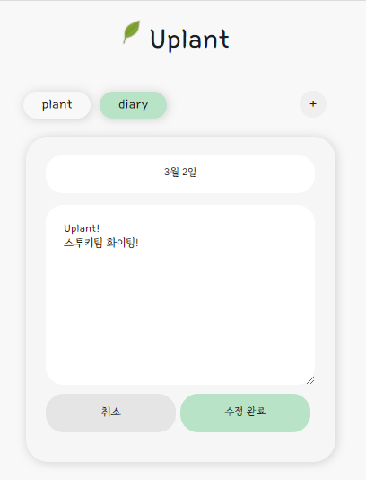

<h1 align="center">&nbsp;&nbsp;Uplant 🌿</h1>
<div align="center">
    <br />
    
    
    
    
</div>

### 👀 [Uplant](https://abcabcp.github.io/uplant/)

### 2022-02-23 ~ 2022-03-02

## 📢 소개
- 식물을 관리하고, 짤막한 하루 일기를 기록할 수 있는 모바일 사이트입니다.

## 🔍 구현화면
### ✔ login & Join
|Login|Join|
|----|----|
||

### ✔ PlantList & PlantPlus & PlantEdit
|PlantList|DiaryList|
|---|---|
|||


### ✔ PlantPlus & DiaryPlus
|PlantPlus|DiaryPlus|
|---|---|
|||


### ✔ PlantEdit & DiaryEdit
|PlantEdit|DiaryEdit|
|---|---|
|||


<br />

## ⛏ 구현 기능
- 로그인, 회원가입, 로그아웃
  - 소셜 로그인 기능 : google, github, facebook
  - 로그인 유저만 본인 게시물 조회 및 관리 가능
- Plant
  - 이미지, 종류, 애칭, 분양날짜 등록 및 수정 기능
  - 물주기 기능
    - 버튼 클릭시 물주는 날짜 업데이트
    - 물준 날짜가 오래된 순으로 정렬
- Diary
  - 제목, 내용 등록 및 수정, 삭제 기능
  - 일기 작성 날짜 최신 순으로 정렬
  
<br />


## 📁 폴더 구조

```
├──	src	
│	├── Components
│	│   └── App.js
│	│   └── Router.js
│	│   └── Header.js
│	│   └── Container.js
│	│   └── Card.js
│	│   └── Input.js
│	│   └── Button.js
│	│   └── Tab.js
│	│   └── TextArea.js
│	│   └── Logout.js
│	│   └── DiaryCard.js
│	│   └── DiaryEdit.js
│	│   └── PlantCard.js
│	│   └── PlantEdit.js
│	├── css
│	│   └── fonts
│	│	│   └── font.module.scss
│	│   └── edit.module.scss
│	│   └── loginform.module.scss
│	│   └── color.module.scss
│	│   └── diarycard.module.scss
│	│   └── diaryplus.module.scss
│	│   └── plantcard.module.scss
│	│   └── plantplus.module.scss
│	├── img
│	│ 
│	├── routes
│	│   └── Login.js
│	│   └── NotFound.js
│	│   └── DiaryList.js
│	│   └── DiaryPlus.js
│	│   └── PlantList.js
│	│   └── PlantPlus.js
│	├── fbase.js
│	├── GlobalStyles.js

```
